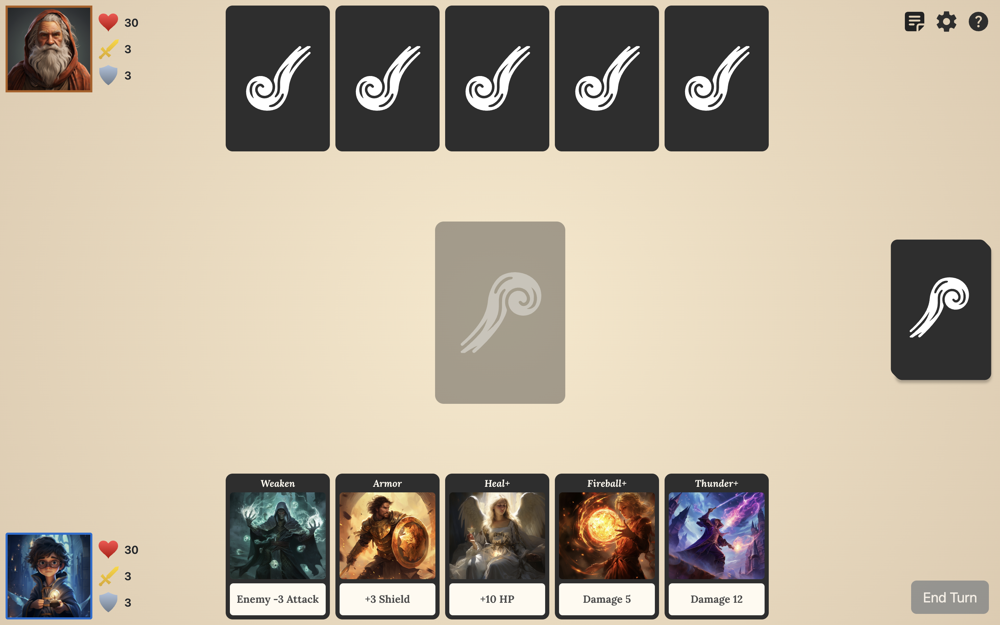

# Wizard Duel

## About the Game

This is a single-player, turn-based card game. You are a young wizard in a magical showdown against powerful enemies. Play your cards wisely to outwit your opponent and reduce their health to zero to win the game.

Try it out yourself at [Wizard Duel](https://wizard-duel-ten.vercel.app/).

## Built with

- React
- Bootstrap
- [boardgame.io](https://boardgame.io/)

## Run it Locally

1. `npm install`
2. `npm start`
3. Navigate to http://localhost:3000

## Notes

1. The game is **web only** and not designed to be mobile-responsive. Please use **Chrome** for the best experience, as other browsers might have issues with audio playback.
2. Vercel's cold start can cause initial delays or unexpected bugs that are not reproducible locally. If you experience this, just wait a few seconds and reload the page, the issue should typically resolve itself.

## Contributing

You are more than welcome to submit issues for bugs, feature requests or any feedback on the game.

## Credits

See [CREDITS.md](./CREDITS.md)

## Changelog

See [CHANGELOG.md](./CHANGELOG.md)

## Licensing

This project is licensed under the MIT License. You may use, modify, or distribute the code as long as you provide attribution to the original author. See [LICENSE](./LICENSE).
